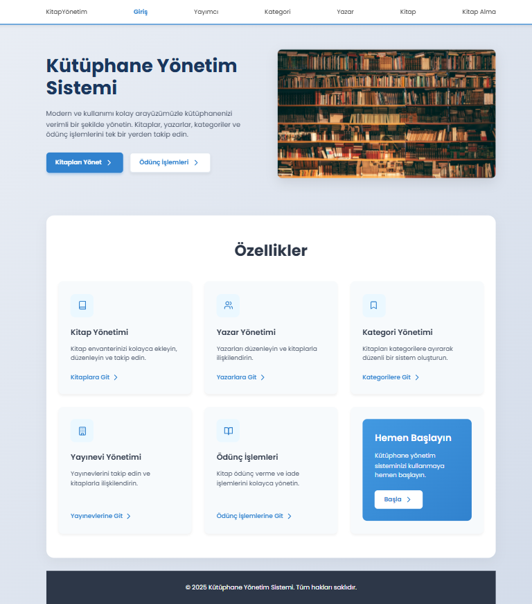
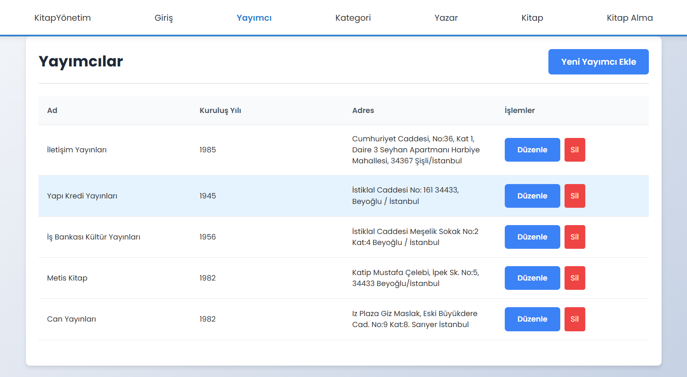
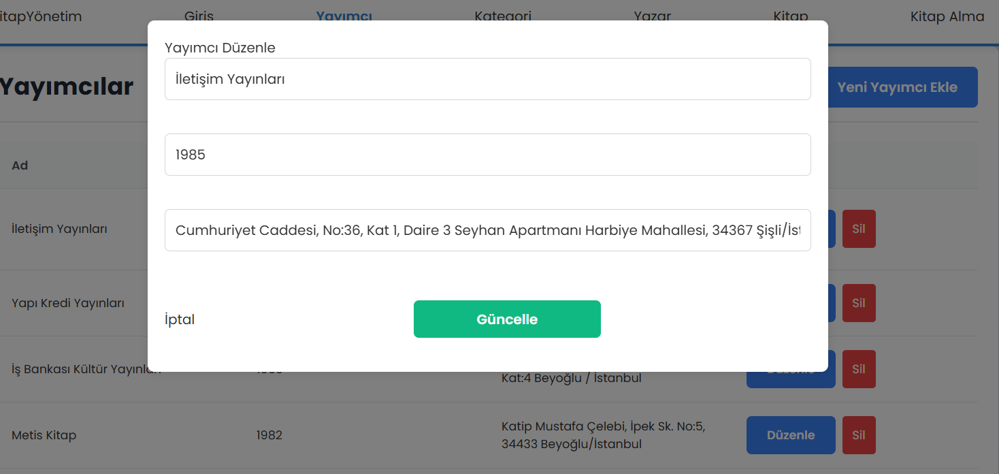
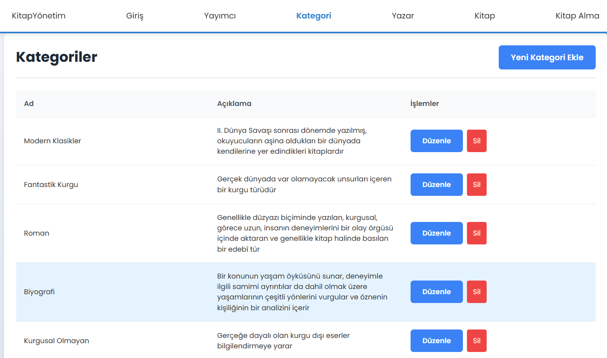
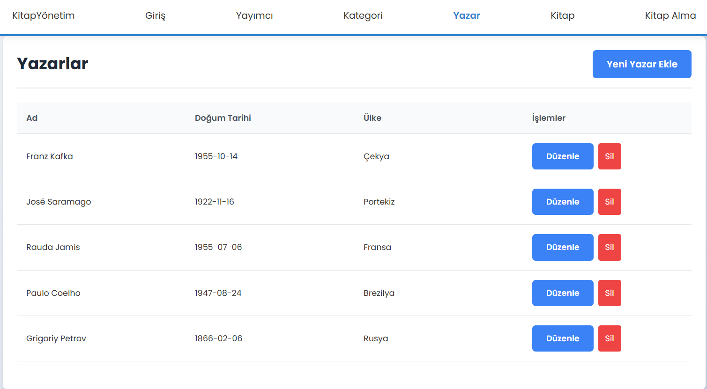
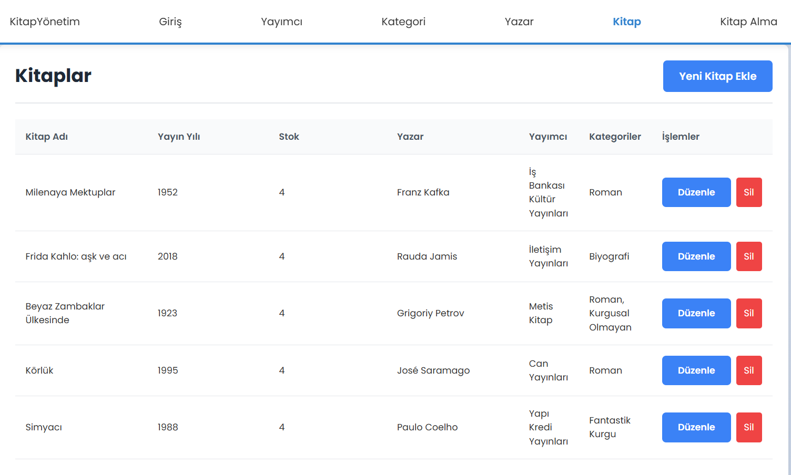
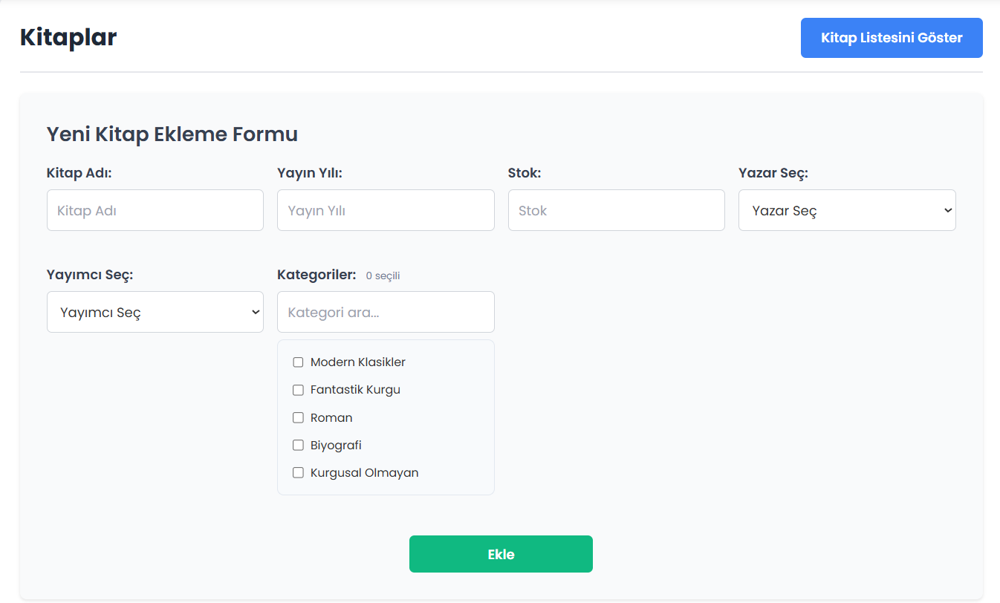
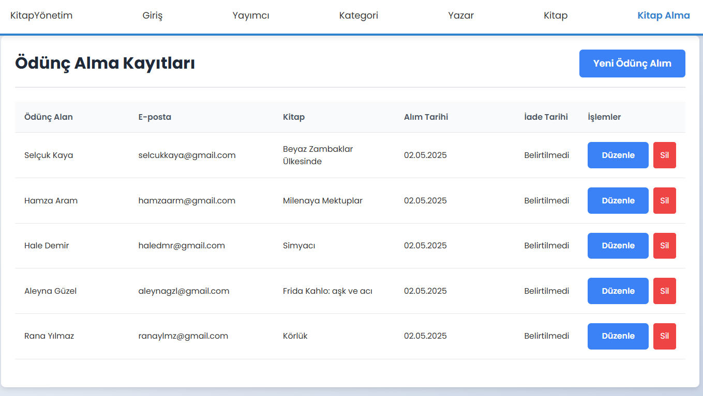

# Kütüphane Yönetim Sistemi

Bu proje, kitapların, yazarların, kategorilerin, yayınevlerinin ve ödünç alma işlemlerinin yönetimini sağlayan kapsamlı bir kütüphane yönetim sistemidir. Modern ve kullanıcı dostu bir arayüz ile kütüphane kaynaklarınızı verimli bir şekilde yönetmenize olanak tanır.

## Özellikler

- **Kitap Yönetimi**: Kitapları ekleyin, düzenleyin, silin ve detaylı bilgilerini görüntüleyin.
- **Yazar Yönetimi**: Yazarları ekleyin, düzenleyin ve kitaplarla ilişkilendirin.
- **Kategori Yönetimi**: Kitapları kategorilere ayırarak düzenli bir sistem oluşturun.
- **Yayınevi Yönetimi**: Yayınevlerini takip edin ve kitaplarla ilişkilendirin.
- **Ödünç İşlemleri**: Kitap ödünç verme ve iade işlemlerini kolayca yönetin.
- **Kullanıcı Dostu Arayüz**: Modern ve sezgisel bir kullanıcı arayüzü ile kolay kullanım.
- **Duyarlı Tasarım**: Mobil cihazlar dahil tüm ekran boyutlarına uyumlu tasarım.

## Teknolojiler

### Frontend
- React.js
- React Router
- React Toastify (bildirimler için)
- CSS (özel stillemeler)

## Proje Görselleri 

### Ana Sayfa

### Yayımcılar

### Yayımcı Güncelleme

### Kategoriler

### Yazarlar

### Kitaplar

### Yeni Kitap Ekleme Formu

### Kitap Ödünç Alma

